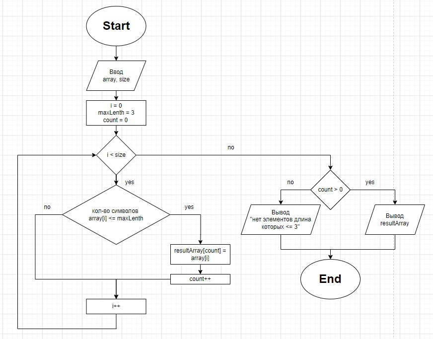

# Условия задачи

Написать программу, которая из имеющегося массива строк форирует массив из строк, длинна которых меньше либо равна 3 символа.

# Блок-схема алгоритма

# Описание решения

1. Задаем первоначальный массив, количество элементов в нем и максимальную длину строки нового массива.
    
    `string[] arr = { "hello", "2", "world", ":-)"};`\
    `int size = arr.Length;`\
    `int maxLength = 3;`

2. Определяем новый массив, в который будут записаны элементы исходного массива, удовлетворяющие условию. Количество элементов нового массива совпадает с количеством элементов в исходном массиве. Также выделяем переменную под счетчик элементов, удовлетворяющих условию.

    `string[] resultArr = new string[size];`\
    `int count = 0;`

3. Для каждого элемента исходного массива проводим проверку на соответствие заданной длине, в случае если условие выполняется записываем данный элемент в новый массив и увеличиваем счетчик на 1.

    `for (int i = 0; i < size; i++)`\
    `{`\
    `if (arr[i].Length <= maxLength)`\
    `{`\
        `resultArr[count] = arr[i];`\
        `count++;`\
    `}`\
`}`

4. Уменьшаем количество элементов в полученном массиве, до значения колличества элементов, удовлетворяющих условию.

    `Array.Resize(ref resultArr, count);`

5. Проводим проверку на наличие в полученном массиве хотябы одного элемента, удовлетворяющего заданному условию, в случае наличия элементов выводим полученный массив на экран в случае отсутствия сообщаем об этом.

    `if (count > 0)`\
    `{`\
        `PrintArr (resultArr);`\
    `}`\
    `else`\
    `{`\
        `Console.Write("[]");`\
    `}`

Примечание: для вывода массива в консоль используется void метод.